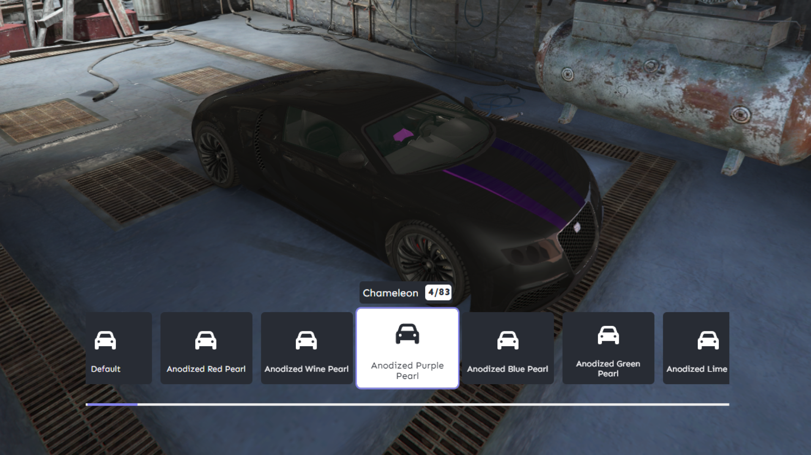

# bl_customs
# Description
bl_customs is a vehicle customization script built using React and TypeScript.

# Requirement
### [ox_lib](https://github.com/overextended/ox_lib)
### [bl_bridge](https://github.com/Byte-Labs-Project/bl_bridge)

# Installation
### Build the source code using `pnpm` or download the [release](https://github.com/Byte-Labs-Project/bl_customs/releases/latest)
# Note: 
The prices for mods, as defined in the configuration, correspond to the price of the last mod index. For example, if a spoiler has four options, the prices for each option will be calculated based on the number of mods, with the last mod having the specified price.
# Preview
https://streamable.com/jkieot
# Discord/Support
### [Byte Labs](https://discord.gg/HGFSzQuHSJ)
